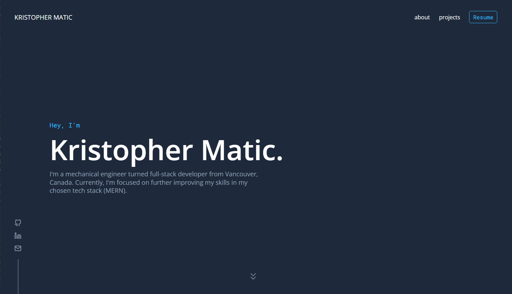

# Personal website

My personal website built with Gatsby, View it at [kristophermatic.com](https://kristophermatic.com/)

Greatly inspired by [Brittany Chiang](https://github.com/bchiang7/v4). Please check out her amazing website!



## Built with

-   [Gatsby](https://www.gatsbyjs.com/)
-   [styled-components](https://styled-components.com/)
-   [GraphQL](https://graphql.org/)
-   [React Icons](https://react-icons.github.io/react-icons/)
-   [React Transition Group](https://github.com/reactjs/react-transition-group)

## Reflection

Gatsby was chosen for static-site generation. This is my very first portfolio website and I took great inspiration in building it. With this project I made sure to create a set of global css styles and variables that would help in reducing redundancy in my styled components. This also helped in the general layout of the webpage which is something I have neglected in previous projects. This would also prove beneficial when designing for responsiveness later on. GraphQL was used to query for data obtained in the filesystem (MDX & png format). This was then used to populate data in the projects cards which will provide ease in future updates.

## Running locally

1. Install the Gatsby CLI

```
npm install -g gatsby-cli
```

2. Clone the repo

```
git clone https://github.com/kmatic/personal-website
```

3. Navigate to folder and install npm packages

```
cd personal-website
npm install
```

4. Run the development server

```
npm start
```
